#  Narradir : Narrator App for _The Resistance: Avalon_ & _Secret Hitler_ 

_Narradir_ [na-rey-deer] is designed to be used with the original _The Resistance: Avalon_ and _Secret Hitler_ board games. You will need at least one of these games, as well as an Android phone, in order to take advantage of this app.

This app automates the night-time narration based on the roles in your game. It offers the following improvements over similar apps out there:

* It allows the user to play a background sound during narration to help cover up any sounds made inadvertently by players.
* It allows the user to change the pause length during which certain characters have to perform their roles.
* In the case of _The Resistance: Avalon_, it provides a "smart" selection for the characters. As the number of players changes, the range of characters available for selection might also change. In addition, certain selection rules apply. Some characters will be automatically selected/deselected depending on the selection/deselection of other characters.

<table>
    <tbody>
        <tr>
            <td>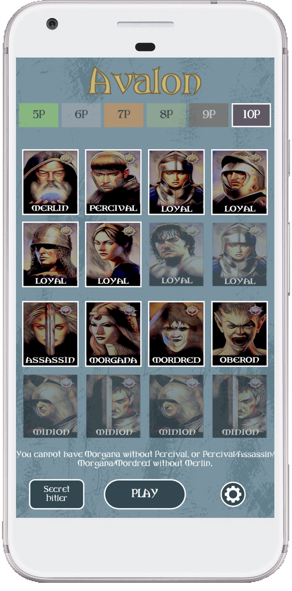</td>
            <td>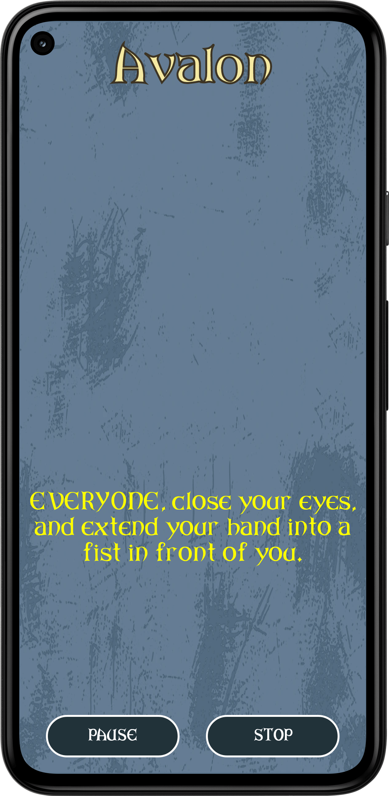</td>
            <td>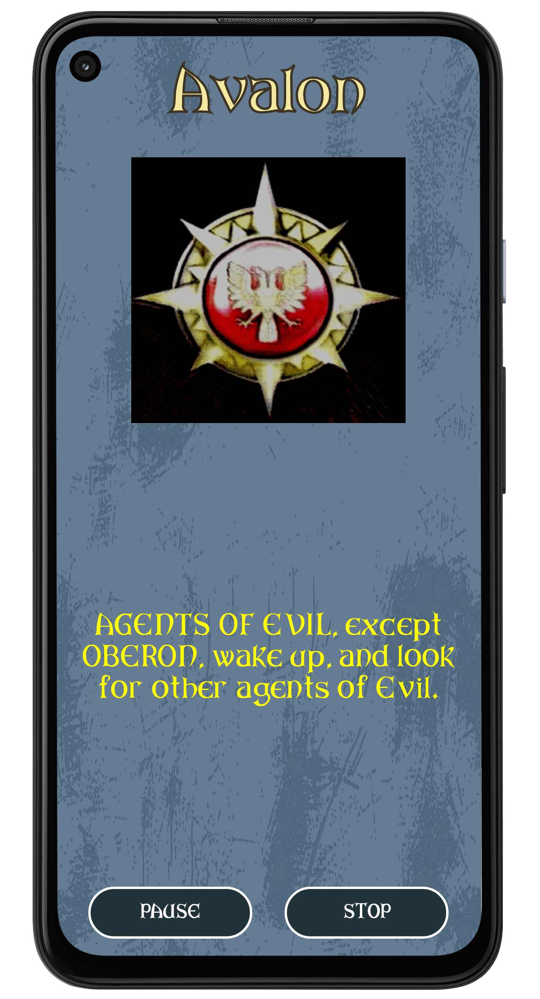</td>
        </tr>
        <tr>
            <td>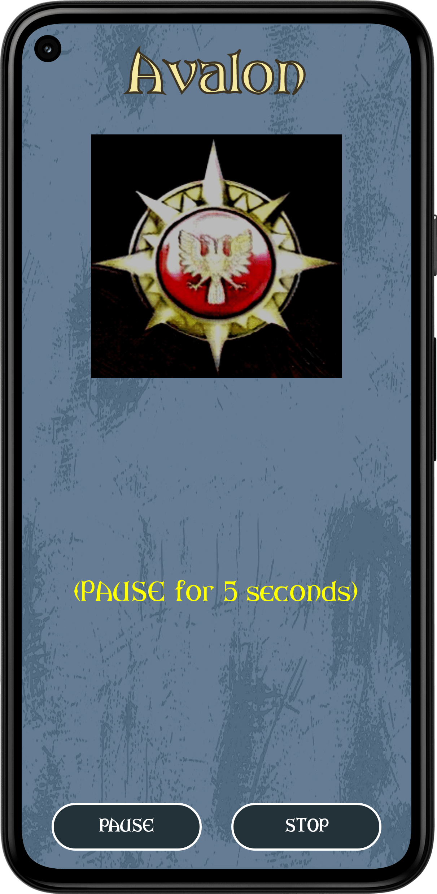</td>
            <td>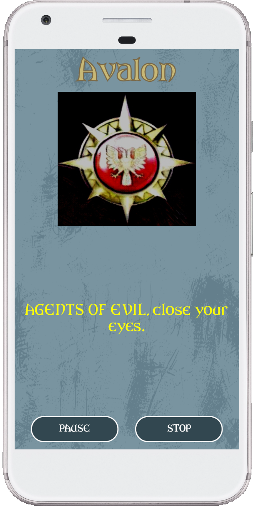</td>
            <td>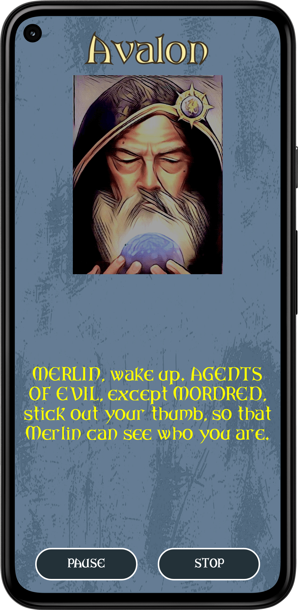</td>
        </tr>
        <tr>
            <td>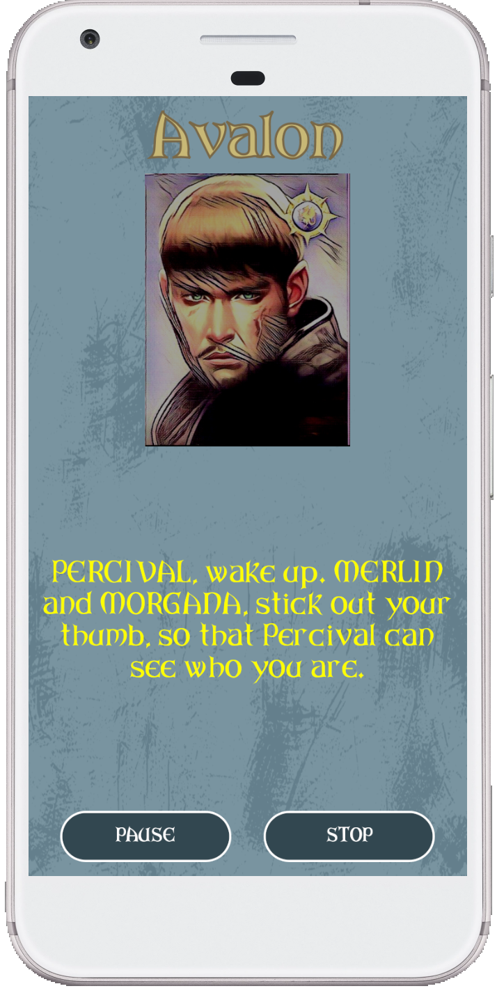</td>
            <td>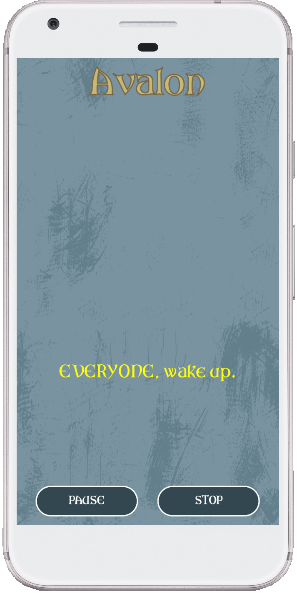</td>
            <td>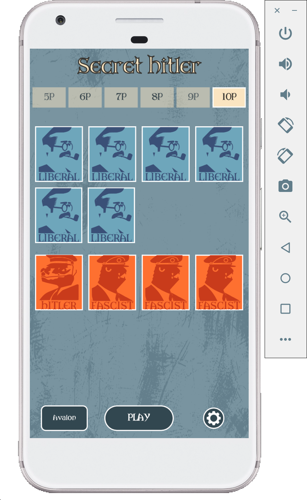</td>
        </tr>
        <tr>
            <td>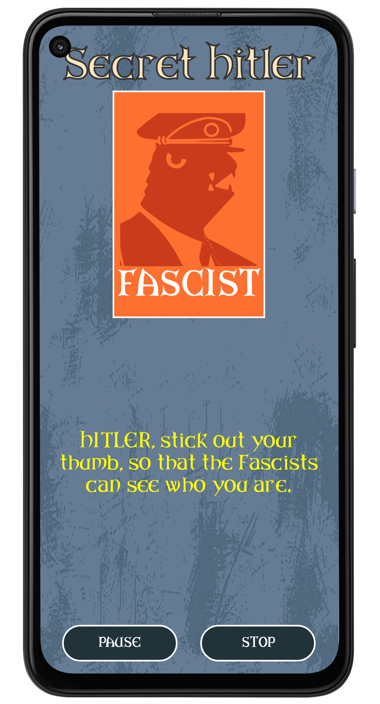</td>
            <td>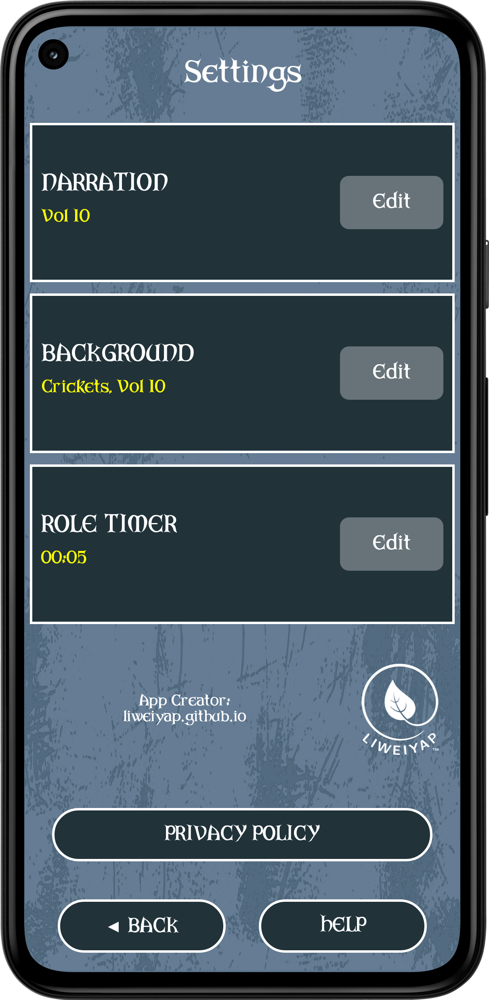</td>
        </tr>
    </tbody>
</table>

## Credits

[_The Resistance: Avalon_](http://indieboardsandcards.com/index.php/our-games/the-resistance-avalon/) is a game for 5–10 players, designed by Don Eskridge, developed by Travis Worthington, and published by Indie Boards and Cards. It is a trademark of Don Eskridge and Indie Boards and Cards.

[_Secret Hitler_](https://www.secrethitler.com/) is a game for 5–10 players, created by Mike Boxleiter, Tommy Maranges, and Max Temkin, and published by Goat, Wolf, & Cabbage LLC. It is copyrighted by Mike Boxleiter, Tommy Maranges, Max Temkin, and Goat, Wolf, & Cabbage LLC.

For the avoidance of doubt, _Narradir_ is not affiliated with or sponsored by Don Eskridge, Travis Worthington, Indie Boards and Cards, Mike Boxleiter, Tommy Maranges, Max Temkin, or Goat, Wolf, & Cabbage LLC. No money was made through the distribution of this app.

_Narradir_ was developed by [Li-Wei Yap](https://liweiyap.github.io/). The code within this app is Copyright © 2021 Li-Wei Yap and licensed under the [GNU General Public Licence v3.0](https://github.com/liweiyap/narradir-android/blob/main/LICENSE). The code may ___not___ be reproduced without citation.

The character artwork for _The Resistance: Avalon_ was designed entirely by Indie Boards and Cards and others including Luis Francisco, George Patsouras, Marco Turini, Pablo Messuti, and Luis Tomas. For the purposes of this app, the character artwork for _The Resistance: Avalon_ was cartoonified using the [Cartoon Photo Editor](https://play.google.com/store/apps/details?id=com.lyrebirdstudio.cartoon.face&hl=en_SG&gl=US) from Lyrebird Studio.

The character artwork for _Secret Hitler_ was designed entirely by Mackenzie Schubert.

The app background was designed by [_Logos by Nick_](https://logosbynick.com/).

The _ARKHAM_ fonts used in the app were designed by [James Cianciaruso](https://j-cianciaruso.wixsite.com/james-cianciaruso).

The gear icon in the settings button was taken from www.flaticon.com and designed by [Freepik](https://www.freepik.com/).

The voice of the narrator is _en-US-Wavenet-B_ from the [Text-to-Speech API](https://cloud.google.com/text-to-speech) of the Google Cloud SDK.

The cards background sound was taken from the YouTube Audio library. The rest of the background sounds were taken from [SoundBible.com](https://soundbible.com/). The [crickets](https://soundbible.com/295-Summer-Crickets-Chirping.html) background sound was recorded anonymously. The [fireplace](https://soundbible.com/2178-Crackling-Fireplace.html) background sound was recorded by Daniel Simion. The [rain](https://soundbible.com/2065-Rain-Inside-House.html) background sound was recorded by Mark DiAngelo. The [rainforest](https://soundbible.com/1818-Rainforest-Ambience.html) background sound was recorded by glorysunz. The [rainstorm](https://soundbible.com/907-Distant-Thunder.html) background sound was recorded by Mike Koenig. The [wolves](https://soundbible.com/277-Medium-Pack-Of-Wolves-Howling.html) background sound was recorded by fws.gov.

The overall app design was inspired by the [_One Night Ultimate Werewolf_](https://play.google.com/store/apps/details?id=com.mobieos.karan.Wolf_Android14_11_13&hl=en_SG&gl=US) app by Bezier Games, Inc., Ted Alspach, Jeremiah Maher, Akihisa Okui, Gus Batts, and Eric Summerer.

The app developer would like to express his deepest gratitude to Rui Xiang Peh, Isla Lim, Darrell Wong, and Li-Toong Yap for their generous help in the internal testing of the app and in providing valuable feedback.

The app developer sincerely apologises in advance if he has forgotten to acknowledge/credit anybody else who needs to be acknowledged/credited.

## Important note

The source code may ___not___ be reproduced without citation. If, for whatever reason, one decides to download the source code and build it himself/herself, please note that there will be a build error because the raw resource MP3 file for the [crickets](https://soundbible.com/295-Summer-Crickets-Chirping.html) background sound is missing. I am not permitted to upload it because it is licensed for personal use only.

## Why the name _Narradir_?

The name is a portmanteau of _narrator_ and _Nadir_, which is the last name of Abed, one of the main characters of the American television sitcom [_Community_](https://en.wikipedia.org/wiki/Community_(TV_series)). In one episode involving delicious chicken fingers, Abed narrated a good chunk of the story line, as if "in a mafia movie" (his own words). In two other episodes featuring Dungeons &amp; Dragons, Abed was the Dungeon Master, whose tasks include narration. The launcher icon of the app is also a reference to the school logo of Greendale Community College, which is the main setting of this sitcom.
